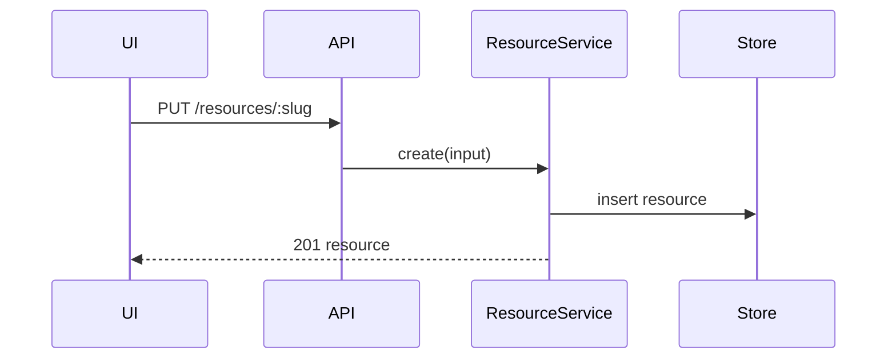
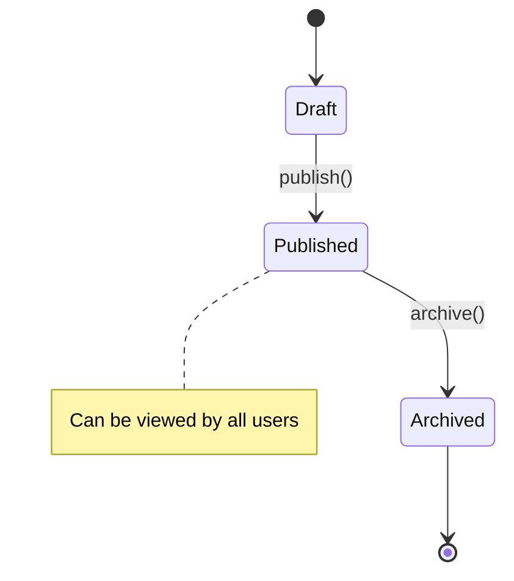
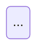

# System Architecture

Bridge the gap between **product requirements** (what the user needs) and
**program design** (the shape of the code). Align on how services, endpoints,
schemas, queues, and stores talk to each other — without getting into
implementation details.

`$ARGUMENTS` is the PRD issue to design. Pass a number, URL, or path.

The issue tracker should have been provided to you — run
`/setup-matt-pocock-skills` if not.

## Process

### 1. Gather context

- **Read the PRD.** Fetch it from the tracker. Read the full body, user stories,
  implementation decisions, testing decisions, and out-of-scope.
- **Read the terrain.** Explore the codebase: existing services, endpoints,
  schemas, data models, and how they currently connect. Read `CONTEXT.md` for
  domain vocabulary. Read relevant ADRs in `docs/adr/`.
- **Read existing architecture.** Check if there are existing Mermaid diagrams,
  endpoint docs, or data models that already describe the area. If they exist,
  start from them and show only the diff.

### 2. Classify the architecture type

Not every feature needs all three artifacts. Classify based on the PRD:

| If the PRD touches… | Produce |
|---|---|
| Multiple services / components + API | Sequence diagram + endpoint contracts + data model |
| A stateful workflow (order status, onboarding steps) | State diagram + data model |
| Only data (new field, new table, no new orchestration) | Data model only |
| Only existing patterns (follows existing routes exactly) | Skip — no new architecture needed |

### 3. Produce artifacts

For each artifact type that fits, produce a draft. Use `CONTEXT.md` vocabulary
for all names. Do **not** write implementation code — only contracts and flows.

#### Mermaid sequence diagram

Produce when the feature introduces new interactions between services,
components, or external systems.

````markdown

````

**Rules:**
- Every participant is a real component, service, or external system (not every function).
- Messages are real operations, not generic "process data".
- Return arrows (`-->>`) carry the response; request arrows (`->>`) carry the payload.
- Limit to the scope of THIS feature — existing infrastructure is background, not part of the diagram.
- If the feature has multiple flows (happy path, error path, edge case), use separate diagrams with clear labels.

#### Mermaid state diagram (stateDiagram-v2)

Produce when the feature involves a stateful workflow with explicit transitions
(order lifecycle, document status, onboarding steps, job pipeline).

````markdown

````

**Rules:**
- States are domain concepts from `CONTEXT.md`, not implementation states.
- Transitions name the action that triggers them, not the condition.
- Use `note` blocks only for non-obvious semantics.
- If the state machine already exists and the feature only adds one transition, use diff notation in comments.

#### Endpoint contracts

Produce when the feature adds or modifies API endpoints (REST, GraphQL, RPC).

````markdown
### Endpoint contracts

```text
PUT /api/resources/:slug
  Request:  { name: string, sourceUrl: string, tags?: string[] }
  Response: { resource: { id: string, name: string, sourceUrl: string, tags: string[], createdAt: string } }
  Errors:   400 — validation error
            409 — slug already exists

GET /api/resources/:slug
  Response: { resource: Resource }
  Errors:   404 — not found
```
````

**Rules:**
- Every endpoint that the sequence diagram references MUST have a contract here.
- Include request shape, response shape, and possible errors.
- Use the domain types from `CONTEXT.md` — if `Resource` is defined in the glossary, reference it.
- If the existing API follows a documented pattern (all routes return `{ data }` wrapping), follow it.

#### Data model

Produce when the feature adds or modifies database tables, documents, or
persisted entities.

````markdown
### Data model

```sql
CREATE TABLE resource (
  slug        TEXT PRIMARY KEY,
  name        TEXT NOT NULL,
  source_url  TEXT NOT NULL,
  tags        TEXT[] NOT NULL DEFAULT '{}',
  created_at  TIMESTAMPTZ NOT NULL DEFAULT now()
);
```

Or for non-SQL projects:

```typescript
// Firestore collection: resources
interface Resource {
  id: string
  name: string
  sourceUrl: string
  tags: string[]
  createdAt: Timestamp
}
```
````

**Rules:**
- Only include tables/entities that are **new or modified** — reference existing ones by name.
- Include indexes, constraints, and defaults — these are architecture decisions.
- If the schema changes are additive-only (new nullable column), note it.
- If the schema requires a migration strategy (backfill, dual-write), put it in Notes.

### 4. Append to the PRD

Append a `## System Architecture` section to the PRD body on the tracker,
after the existing `## Implementation Decisions` section.

**How** depends on the tracker:

- **GitHub:** Read the current body with `gh issue view <number> --json body`,
  insert the section after `## Implementation Decisions` (or before `## Testing
  Decisions` if that section exists), write back with
  `gh issue edit <number> --body "<full-body>"`.
- **Local files:** Read the file, insert the section after `## Implementation
  Decisions`, write back.
- **GitLab / Linear:** Follow the tracker's convention for updating issue
  descriptions.

The appended section uses this structure; omit any artifact type that isn't
relevant:

```markdown
## System Architecture

### Interaction flow

```mermaid
sequenceDiagram
...
```

### State machine (if applicable)



### Endpoint contracts

```text
...
```

### Data model

```sql
...
```

### Architecture notes

Any non-obvious constraints, migration strategy, integration patterns,
or ADR references.
```

Omit sections that are empty — don't produce "N/A" placeholders.

Then remove the `ready-for-agent` label (if present) and apply `needs-architecture`
(or equivalent — see the tracker's triage labels). The architecture needs review
before tickets are created.

### 5. Stop for review

Do **not** proceed to tickets or implementation. Report what was produced and
ask:

> "The architecture for this PRD is ready. The diagrams and contracts
> describe how the services communicate. Would you like to modify anything
> or proceed with to-issues?"

If the user corrects anything, incorporate the fix and re-append the section
(overwrite the previous one). Only when they approve does the PRD move back
to `ready-for-agent` — or directly to `to-issues`.

## How other skills use this

- **to-issues:** Reads the PRD (now with `## System Architecture`) and creates
  tickets informed by the endpoint contracts and data model. Each ticket
  inherits its piece of the architecture.
- **program-design:** Reads the relevant ticket to produce per-ticket
  call-stack tree, file-tree diff, and type signatures. The architecture
  provides context ("this ticket implements the `PUT /resources/:slug` endpoint,
  with these signatures").
- **implement-loop:** The implement subagent sees the full ticket body,
  which includes both the architecture context and the program design
  signatures.

## When to skip

Classify the PRD before producing artifacts. Skip if:

| Type | Reason |
|---|---|
| **Bug fix** | "400 error when X is null" — no new architecture |
| **Trivial feature** | "Add phone field to profile" — follows existing pattern |
| **Mechanical refactor** | "Rename UserService → AccountService" — no architectural change |
| **Data only** | New table, no new endpoints or orchestration — data model only |
| **Follows existing pattern** | New CRUD route identical to the 10 existing ones |

When in doubt, do it. 10 minutes of diagrams > 3 hours of reviewing code
with the wrong architecture.

## Relationships with other skills

| Skill | Relationship |
|---|---|
| `to-prd` | Produces the PRD. System architecture evolves it — adds the `## System Architecture` section. |
| `to-issues` | Reads the PRD (now including architecture) to create informed tickets. |
| `program-design` | System architecture describes *external* contracts (services). Program design describes the *internal* shape of code (signatures). They are complementary. |
| `codebase-design` | Provides vocabulary (deep module, seam). System architecture is a different layer — it's about connections between modules, not a module's depth. |
| `domain-modeling` | System architecture uses `CONTEXT.md`. If an ambiguous term emerges during architecture, call `domain-modeling`. |
| `improve-codebase-architecture` | If a structural problem emerges during system architecture (e.g. "this service is too coupled"), note it but don't resolve it here. |
